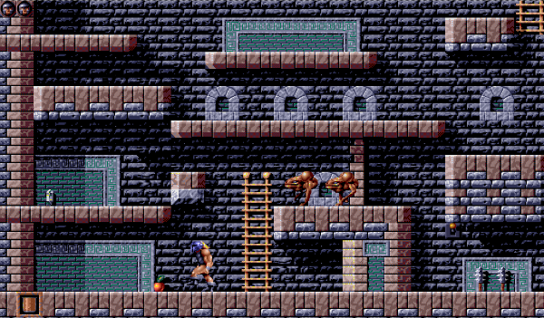

# Games written using AthenaJS

The following games have been written using AthenaJS.

## Gods

[![Gods]](img/gods.png)](https://athenajs.github.io/athenajs-gods/)

Gods is a simple remake of the [Gods](http://hol.abime.net/2754) game from the [Bitmap Brothers](https://en.wikipedia.org/wiki/The_Bitmap_Brothers) and features:

 - map-based background with 64x32px tiles
 - multiple animation based sprites
 - map triggers
 - enemy waves
 - vertical & horizontal scrolling

## AthenaJS-Tetris

[![Tetris]](img/tetris.png)](https://athenajs.github.io/athenajs-tetris/)

AthenaJS-Tetris shows how AthenaJS can be used to create Tetris-like games using AthenaJS and makes use of the following features:

 - dynamic map-based background
 - animated shapes
 - user-behavior